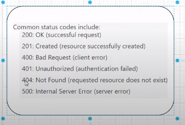

# DAY-10 | API




API stands for Application Programming Interface. It's a set of rules and protocols that allows different software applications to communicate and interact with each other. APIs are used to enable the exchange of data and functionality between different systems, which can be running on different servers, devices, or platforms.

When you make an API request, you're essentially asking a remote server or service to perform a specific action or provide you with specific data. Here's a breakdown of the components and process of an API request:

1. **Endpoint**: An API endpoint is a specific URL where an API can be accessed. It's like a unique address for a specific function or resource provided by the API. For example, if you're using a weather API, an endpoint might be something like `https://api.weather.com/forecast`.

2. **HTTP Method**: The HTTP method (or verb) specifies the type of action you want to perform on the resource. The most common methods are:
   - **GET**: Retrieve data from the server.
   - **POST**: Send data to the server (e.g., submitting a form).
   - **PUT**: Update an existing resource.
   - **DELETE**: Remove a resource.

3. **Headers**: Headers contain additional information about the request, such as authentication tokens, content type, and more. They are sent along with the request to provide extra context.

4. **Parameters or Payload**: Depending on the API and the action you're performing, you may need to include parameters or a payload. These are usually sent in the body of the request (for methods like POST or PUT) or as part of the URL (for methods like GET).

5. **Authentication**: Some APIs require authentication to access their resources. This could be in the form of an API key, a token, or other authentication mechanisms.

6. **Response**: Once the server receives your request, it processes it and sends back a response. This response typically includes a status code, headers, and the actual data (if any). The status code indicates whether the request was successful, encountered an error, or had some other outcome.

   Common status codes include:
   - 200: OK (successful request)
   - 201: Created (resource successfully created)
   - 400: Bad Request (client error)
   - 401: Unauthorized (authentication failed)
   - 404: Not Found (requested resource does not exist)
   - 500: Internal Server Error (server error)

7. **Data Format**: The data returned by the API is often in a structured format, such as JSON (JavaScript Object Notation) or XML (eXtensible Markup Language). JSON is the most common format for modern APIs.

8. **Parsing the Response**: After receiving the response, your application needs to parse it to extract the relevant information. This is where you extract the data you need from the JSON or XML response.

In summary, making an API request involves specifying the API endpoint, choosing the appropriate HTTP method, including any necessary parameters or payload, adding headers (if required), and handling the response once it's returned.

# Hands-On

Making HTTP requests and interacting with RESTful APIs in Python involves using libraries like `requests` or `http.client` to send HTTP requests to a server, and then processing the responses. 

Here, I'll provide examples using the `requests` library, which is a popular choice for making HTTP requests in Python.

### Installing the requests library:

```bash
pip install requests
```

### Making GET Requests:

```python
import requests

# Make a GET request to a URL
response = requests.get('https://jsonplaceholder.typicode.com/posts/1')

# Check if the request was successful (HTTP status code 200)
if response.status_code == 200:
    # Print the response content
    print(response.json())
else:
    # Print an error message if the request was not successful
    print(f'Error: {response.status_code}')
```

In this example, we're making a GET request to retrieve a specific post from the JSONPlaceholder API. We then check if the request was successful (status code 200) and print the response content.

### Making POST Requests:

```python
import requests

# Define the URL and payload data
url = 'https://jsonplaceholder.typicode.com/posts'
data = {
    'title': 'foo',
    'body': 'bar',
    'userId': 1
}

# Make a POST request with the data
response = requests.post(url, json=data)

# Check if the request was successful (HTTP status code 201 for created)
if response.status_code == 201:
    print(f'Success! New post created with ID {response.json()["id"]}')
else:
    print(f'Error: {response.status_code}')
```

In this example, we're making a POST request to create a new post on the JSONPlaceholder API. We provide the URL and the data we want to send as a JSON payload.

### Making PUT and DELETE Requests:

```python
import requests

# Define the URL and updated data
url = 'https://jsonplaceholder.typicode.com/posts/1'
data = {
    'title': 'updated title',
    'body': 'updated body',
}

# Make a PUT request to update the resource
response = requests.put(url, json=data)

# Check if the request was successful (HTTP status code 200 for OK)
if response.status_code == 200:
    print(f'Success! Post updated: {response.json()}')
else:
    print(f'Error: {response.status_code}')

# Make a DELETE request to delete the resource
response = requests.delete(url)

# Check if the request was successful (HTTP status code 200 for OK)
if response.status_code == 200:
    print('Success! Post deleted.')
else:
    print(f'Error: {response.status_code}')
```

In the above example, we're making a PUT request to update a specific post and a DELETE request to delete the same post.

These are basic examples to get you started with making HTTP requests and interacting with RESTful APIs in Python. Depending on the API you're working with, you may need to handle authentication, headers, pagination, and other features specific to that API.
